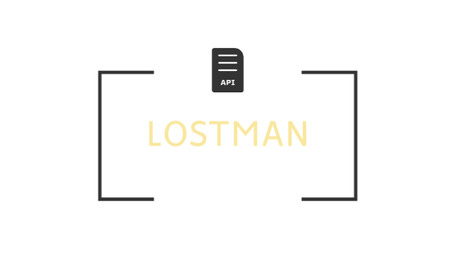

<p align="center">
  <picture>
    <source media="(prefers-color-scheme: dark)" srcset="images/logo-badge.png">
    
  </picture>
</p>

<p align="center">
  <a href="https://github.com/AliHammoud995/lostman/releases/latest"></a>
  <a href="https://github.com/AliHammoud995/lostman/actions/workflows/ci.yml"></a>
  
  
  
</p>

# Lostman

A **free, offline Postman alternative** — a REST, GraphQL, WebSocket & SSE API client
for **Windows and Linux**. No login, no account, no cloud sync — everything is stored
locally on your machine.

## Features

- **Requests** — GET / POST / PUT / PATCH / DELETE / HEAD / OPTIONS with query params,
  headers, body (raw JSON/text, **GraphQL**, form-data **with file uploads**,
  x-www-form-urlencoded) and auth (Bearer, Basic, API key, **OAuth 2.0** with client
  credentials or authorization-code + PKCE, **Digest**, **AWS Signature v4**).
- **WebSocket & SSE** — pick WS or SSE as the method to get a live message console with
  Connect/Disconnect and a send box.
- **Cookies** — Set-Cookie responses are captured automatically and sent back on matching
  requests; inspect and clear them per domain from the Cookies manager.
- **Scripts & tests** — pre-request scripts (mutate `pm.request`, set variables) and test
  scripts (`pm.test("ok", () => expect(pm.response.code).toBe(200))`) with a pass/fail
  Tests tab on every response.
- **Request chaining** — reference earlier responses anywhere:
  `{{res.Login.body.token}}`, `{{res.last.status}}`, `{{res.Login.headers.content-type}}`.
- **Collection runner** — run a whole collection in order (▶), optionally iterating over a
  CSV or JSON data file whose columns become `{{variables}}`, with live results and test counts.
- **URL ↔ Params sync** — type `?key=value` in the URL bar and the Params table fills in,
  edit the table and the URL updates.
- **Tabs** — work on several requests at once; open tabs are restored on restart.
  Right-click a tab for Rename / Duplicate / Save As / Close Others.
- **Collections & folders** — save and organize requests, drag-and-drop to reorder or
  move between folders, duplicate/rename from the sidebar, all persisted locally.
- **History** — the last 100 requests you sent, one click to re-open.
- **Search everywhere** — filter collections and history from the sidebar; find text in a
  response body with `Ctrl+F`.
- **Environments** — define `{{variables}}` (with `{{` autocomplete while typing) in
  environments or **Globals**, mask secrets with the 👁 toggle, import from `.env` files,
  and switch environments from the top bar.
- **Responses** — status / time / size, pretty-printed JSON with syntax highlighting,
  raw view, HTML and image preview, response headers, copy to clipboard, save the
  full body to a file, and **Pin + Diff** to compare two responses line by line.
- **History with snapshots** — recent history entries restore the response too, not just
  the request.
- **Settings** — light/dark theme, request timeout, follow-redirects toggle, and an SSL
  verification toggle for local servers with self-signed certificates.
- **Proxy & mTLS** — no proxy / system proxy / manual proxy with auth and a bypass list;
  per-hostname client certificates (PFX or PEM) for mutual TLS.
- **Large responses** — bodies stream to disk up to 500 MB with a fast 2 MB preview;
  Save always writes the exact full bytes.
- **Command palette** — `Ctrl+K` fuzzy-jumps to any saved request, open tab, or action.
- **Multi-window** — `Ctrl+Shift+N` opens another window; collections and environments
  stay in sync between windows.
- **Auto-updates** — installed builds check GitHub Releases on startup and offer a
  one-click restart when a new version is ready.
- **Portable mode** — flip a switch in Settings to keep all data next to the app
  (great on USB sticks); Lostman auto-detects it on launch.
- **5 languages** — English, العربية (with right-to-left layout), Français, Español and
  Deutsch, switchable in Settings.
- **Import anything** — Postman collections (v2.x) and environments, OpenAPI 3 / Swagger 2
  specs (JSON), pasted cURL commands, and Lostman backups — all from the sidebar's
  Import button.
- **Export & backup** — export any collection as Postman v2.1 JSON (⇩ on the collection),
  and back up / restore the entire app from Settings.
- **Code generation** — the `</>` button turns any request into a ready-to-run snippet:
  cURL, JavaScript (fetch / axios), Python (requests), PowerShell, C# (HttpClient),
  or Go (net/http).
- **No CORS problems** — requests are sent from the app's backend process, not a browser page.

## Keyboard shortcuts

| Shortcut | Action |
|---|---|
| `Ctrl+Enter` | Send request |
| `Ctrl+S` | Save request to a collection |
| `Ctrl+Shift+S` | Save request as a copy |
| `Ctrl+F` | Find in response body |
| `Ctrl+K` | Command palette |
| `Ctrl+T` | New request tab |
| `Ctrl+W` | Close current tab |
| `Ctrl+Shift+N` | New window |
| `F12` | Toggle DevTools |

## VS Code extension

[](https://marketplace.visualstudio.com/items?itemName=AkbarHammoud.lostman-api-client)
[](https://marketplace.visualstudio.com/items?itemName=AkbarHammoud.lostman-api-client)

Lostman also runs **inside VS Code** — same UI, same features, same shared HTTP engine.
Install it [from the Marketplace](https://marketplace.visualstudio.com/items?itemName=AkbarHammoud.lostman-api-client)
or from the Extensions view:

```
ext install AkbarHammoud.lostman-api-client
```

Then `Ctrl+Shift+P` → **"Lostman: Open API Client"**. Its data lives in VS Code's global
storage, separate from the desktop app. To build it yourself: `cd vscode && npm run package`
(a `.vsix` is also attached to every GitHub release).

## Run from source

```
npm install
npm start
```

## Build installers

```
npm run dist         # Windows: NSIS installer + portable .exe
npm run dist:linux   # Linux:   AppImage + .deb (run this on Linux)
npm run dist:all     # both
```

Everything lands in the `dist/` folder with the Lostman icon. The AppImage runs on any
distro (`chmod +x Lostman-*.AppImage && ./Lostman-*.AppImage`); the `.deb` installs on
Debian/Ubuntu with `sudo dpkg -i`.

Official builds are produced by CI: pushing a `v*` tag makes GitHub Actions build the
Windows installer/portable exe and the Linux AppImage/deb, and attach them all to a
GitHub Release automatically.

## Where is my data?

Everything (collections, history, environments, open tabs, settings) lives in a single JSON file:

```
Windows:  %AppData%\Lostman\lostman-data.json
Linux:    ~/.config/Lostman/lostman-data.json
```

Delete that file to reset the app. Copy it to another machine to move your data.

## Notes

- Response bodies over 2 MB are truncated in the viewer; **Save** still writes the complete
  body (large bodies stream to disk, capped at 500 MB).
- Run the test suite with `npm test` and the linter with `npm run lint`.
- See [ROADMAP.md](ROADMAP.md) for what's planned next.
